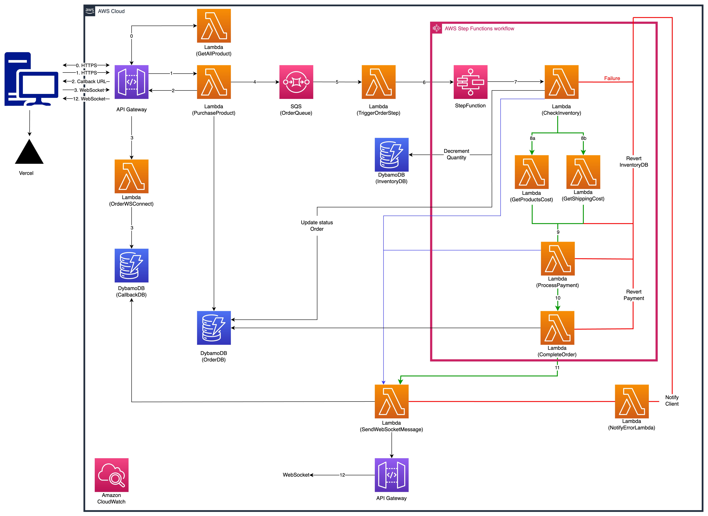

# e-Commerce Saga Orchestration Implementation
Il presente progetto ha lo scopo di implementare un prototipo di flusso di un e-Commerce attraverso alcune tecnologie di Amazon AWS previste nel pattern della Saga Orchestration.

## Autori
- Lorenzo Marcolli (mat. 08302A)
- Alberto Rizzi (mat. 08303A)

## Diagram flow

    </img>

[ 🔗 Draw.io](https://drive.google.com/file/d/14FBuOeF2dJOKJoST7JyEinbuRB0JBPWc/view?usp=sharing)

## Relazione
[ 🔗 Relazione](/assets/relazione.pdf)

## Presentazione
[ 🔗 Presentazione Lorenzo Marcolli](/assets/presentazione_marcolli.pdf)
[ 🔗 Presentazione Alberto Rizzi](/assets/presentazione_rizzi.pdf)

## Live Demo
[ 💻 Vercel](https://ecommerce-orchestration-microservice.vercel.app/)

    </img>

## Tecnologie usate
### Cloud
- AWS Lambda
- AWS SQS
- AWS Step Function
- AWS API Gateway
- AWS DynamoDB

### Client
- Next.js
- Typescript
- Tailwind.css